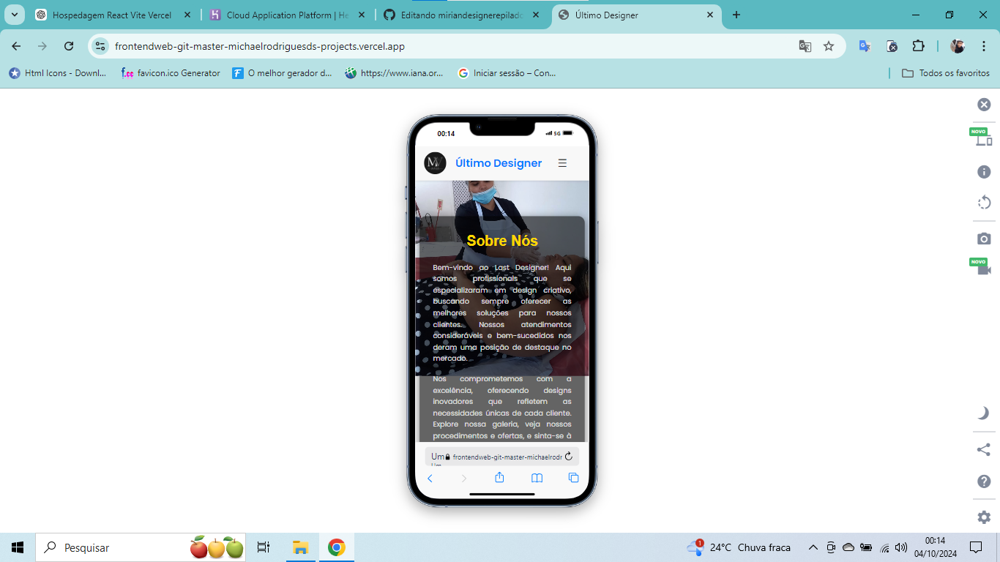

# 💄 Projeto de Frontend - Estética e Beleza // PROJETO AINDA EM FAZE BETA ..

Este projeto é um site de serviços de estética que exibe preços e detalhes de procedimentos como **depilação**, **design de sobrancelhas** e **cílios**. Ele foi desenvolvido com **React** utilizando o **Vite** e se comunica com um backend Node.js/Express integrado ao **MongoDB Cloud**.

## 🌐 Link do Projeto Online
- **[Frontend Estética e Beleza] (https://miriandesignerepiladora.onrender.com/)**
- **[Repositório do Backend](https://github.com/Michaelrodriguesds/backende-Deploy)**

## 🚀 Objetivo do Projeto
O site visa oferecer uma interface amigável para exibição de serviços estéticos e permitir a interação com o backend, para gerenciamento de informações de forma dinâmica e eficiente.

## 🛠️ Tecnologias Utilizadas
- **Frontend**: React, Vite, CSS Modules, Axios, React Router
- **Backend**: Node.js, Express, MongoDB Cloud, Mongoose

## ⚙️ Funcionalidades
- Listagem de serviços estéticos com preços e detalhes.
- Rotas dinâmicas para navegação entre as páginas de serviços.
- Comunicação com o backend para manipulação de dados via API.
- Formulários de recados com para duvidas, criticas ou elogios dos usuarios
- Pagina de administração com rota privada onde somente a dona do site pode manipular.
- excluir recados , aprova recados , adiciona ofertas , procedimentos e recados.

## 🔥 Desafios Enfrentados
1. Integração com o backend para operações CRUD com o MongoDB.
2. Configuração correta das rotas no Netlify e Vercel.
3. Garantir a responsividade para dispositivos móveis e desktops.
4. Otimização do SEO para melhor visibilidade nos motores de busca.


## 📝 Como Rodar o Projeto Localmente
1. Clone o repositório:
   ```bash
   git clone https://github.com/Michaelrodriguesds/Frontendweb.git
npm install
npm run dev
.

🔗 Link para o Backend
https://github.com/Michaelrodriguesds/backende-Deploy
 
 

# Projeto de Frontend - Estética e Beleza

## Capturas de Tela

### Versão para Celular:


### Versão para PC:


